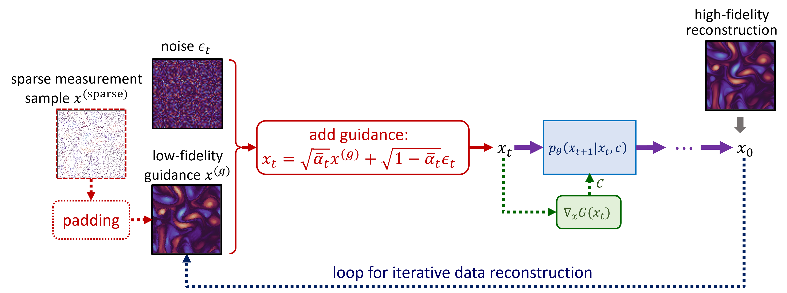
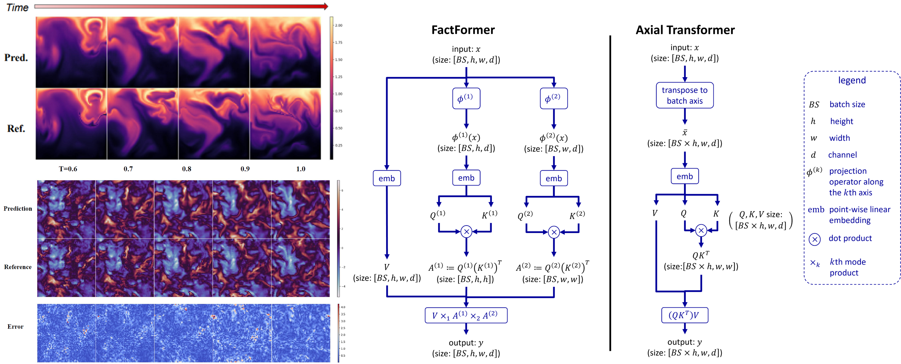
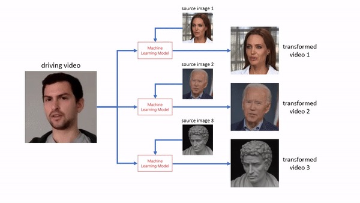
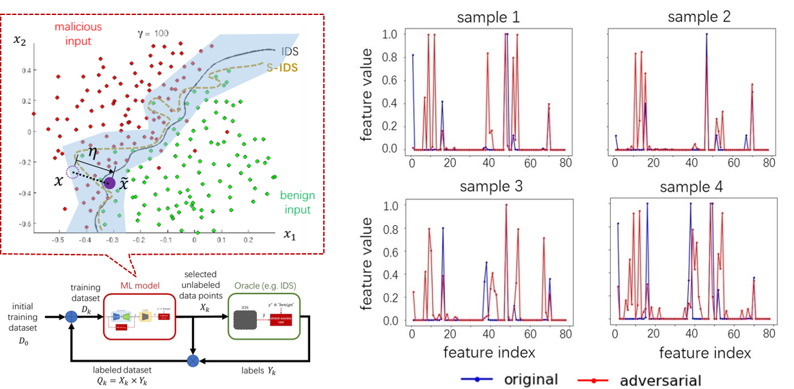

# PhD Student
[Mechanical and AI Lab](https://sites.google.com/view/barati) • 
[Department of Mechanical Engieering](https://www.meche.engineering.cmu.edu/) •  
[Carnegie Mellon University](https://www.cmu.edu/) 
## Research Objective: 
### Develop deep generative models to improve the efficiency and safety of computational tools  

Expect to graduate on 2024 Summer • Open to work

[Google Scholar](https://scholar.google.com/citations?hl=en&user=dNWXwYMAAAAJ) | [LinkedIn](https://www.linkedin.com/in/dule-shu-71a4b6a6/) | [GitHub](https://github.com/dlshu)

## Selected Projects
- ### A physics-informed diffusion model for high-fidelity flow field reconstruction ([paper](https://www.sciencedirect.com/science/article/pii/S0021999123000670) | [code](https://github.com/BaratiLab/Diffusion-based-Fluid-Super-resolution/tree/main_v1))

A denoising diffusion probablistic model for robust super-resolution of turbulent flow data. Currently in the process of being incoprated to [modulus](https://github.com/NVIDIA/modulus).

  

- ### Scalable Transformer for PDE Surrogate Modeling* ([paper](https://arxiv.org/pdf/2305.17560.pdf) | [code]([https://github.com/BaratiLab/Diffusion-based-Fluid-Super-resolution/tree/main_v1](https://github.com/BaratiLab/FactFormer)))

A computationally more efficient neural PDE solver using multi-dimensional factorized attention.  
(* second author, paper accepted for [NeurIPS 2023](https://nips.cc/Conferences/2023) poster session.)

- ### Spatial Completion of Turbulent Data Using Deep Generative Models* (paper | code)

A study on reconstructing the missing region in turbulent flow data with vector-quantized generative adversarial network model.
(* ongoing project, manuscript coming out soon)

  

- ### Talking-head Video Synthesis Using a Face-transformation generative model* ([paper](https://par.nsf.gov/biblio/10292836) | [code](https://github.com/AliaksandrSiarohin/first-order-model))

A study to investigate STEM learners’ ability to decipher AI-generated video created by a face-swapping generative model.
(* The face-swapping model is adopted from the work by A. Siarohin et al. )

- ### 3d design using generative adversarial networks and physics-based validation* ([paper](https://asmedigitalcollection.asme.org/mechanicaldesign/article/142/7/071701/1067306/3D-Design-Using-Generative-Adversarial-Networks) | code)

A deep generative model to synthesize 3D mesh objects for evaluating a design cycle consisting of synthesis and physics-based validation.
(* The code is currently being updated to support newer version of PyTorch and CUDA toolkit. Will become available soon. )

- ### Generative Adversarial Attacks Against Intrusion Detection Systems Using Active Learning ([paper](https://dl.acm.org/doi/abs/10.1145/3395352.3402618) | [code](https://github.com/dlshu/adversarial-attack-on-IDS))

A generative adversarial active Learning method to model query-efficient attacks against network intrusion detection systems for safefy evaluation/

